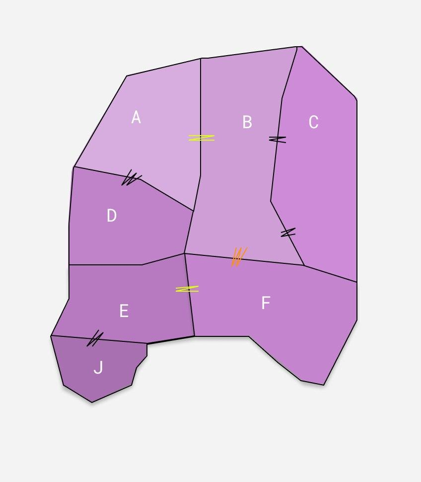

# VANILLA-MERGE

Vanilla-merge is powerful, interesting and messy polygon-clipping algorithm.
The name represents the main idea - naively merge set of polygons into one edge by edge.
There is little inaccuracy when it comes to operations with floating point. 
That's why vanilla-merge is not based on boolean operations.

## USAGE

    import vanilla from '@bigfloppa/vanilla-merge'
    
    const firstPolygon =
        [
            [50.455244460507664, 30.47909499027736],
            [50.45532838404314, 30.47858006117565],
            [50.4554255902542, 30.477987371118644],
            [50.455575323654266, 30.47706372293666],
            [50.455830637969996, 30.47547873905774],
            [50.45607167172392, 30.474390280110853],
            [50.4556701507806, 30.473353186559788],
            [50.45555905852214, 30.47302697001113],
            [50.45487317884009, 30.4743621820857],
            [50.45439015901203, 30.475454628328524],
            [50.45409551449518, 30.47656224743583],
            [50.455018083826815, 30.476850531861025],
            [50.45537551422964, 30.47700226050586],
            [50.455244460507664, 30.47909499027736],
        ];

    const secondPolygon =
        [
            [50.455244460507664, 30.47909499027736],
            [50.4559019946575, 30.479384400447408],
            [50.45660234943804, 30.479665098462895],
            [50.45707568678229, 30.479847172836703],
            [50.457635957517546, 30.48008993866844],
            [50.45913739577294, 30.482449038397625],
            [50.458430932719104, 30.480678502344276],
            [50.45766989364234, 30.478741062263992],
            [50.45691027827954, 30.476754002072038],
            [50.45640912649513, 30.475362383284445],
            [50.456212397841966, 30.47483235023148],
            [50.45607167172392, 30.474390280110853],
            [50.455830637969996, 30.47547873905774],
            [50.455575323654266, 30.47706372293666],
            [50.4554255902542, 30.477987371118644],
            [50.45532838404314, 30.47858006117565],
            [50.455244460507664, 30.47909499027736],
        ];

    const union = vanilla([firstPolygon, secondPolygon]);
    console.log(union);

    // LOG:
    [
        [
        [ 50.455244460507664, 30.47909499027736 ],
        [ 50.4559019946575, 30.479384400447408 ],
        [ 50.45660234943804, 30.479665098462895 ],
        [ 50.45707568678229, 30.479847172836703 ],
        [ 50.457635957517546, 30.48008993866844 ],
        [ 50.45913739577294, 30.482449038397625 ],
        [ 50.458430932719104, 30.480678502344276 ],
        [ 50.45766989364234, 30.478741062263992 ],
        [ 50.45691027827954, 30.476754002072038 ],
        [ 50.45640912649513, 30.475362383284445 ],
        [ 50.456212397841966, 30.47483235023148 ],
        [ 50.45607167172392, 30.474390280110853 ],
        [ 50.4556701507806, 30.473353186559788 ],
        [ 50.45555905852214, 30.47302697001113 ],
        [ 50.45487317884009, 30.4743621820857 ],
        [ 50.45439015901203, 30.475454628328524 ],
        [ 50.45409551449518, 30.47656224743583 ],
        [ 50.455018083826815, 30.476850531861025 ],
        [ 50.45537551422964, 30.47700226050586 ],
        [ 50.455244460507664, 30.47909499027736 ],
        [ 50.455244460507664, 30.47909499027736 ]
        ]
    ]

## EXAMPLE
There are seven adjoining polygons as input so output will be single merged polygon.

 
 
